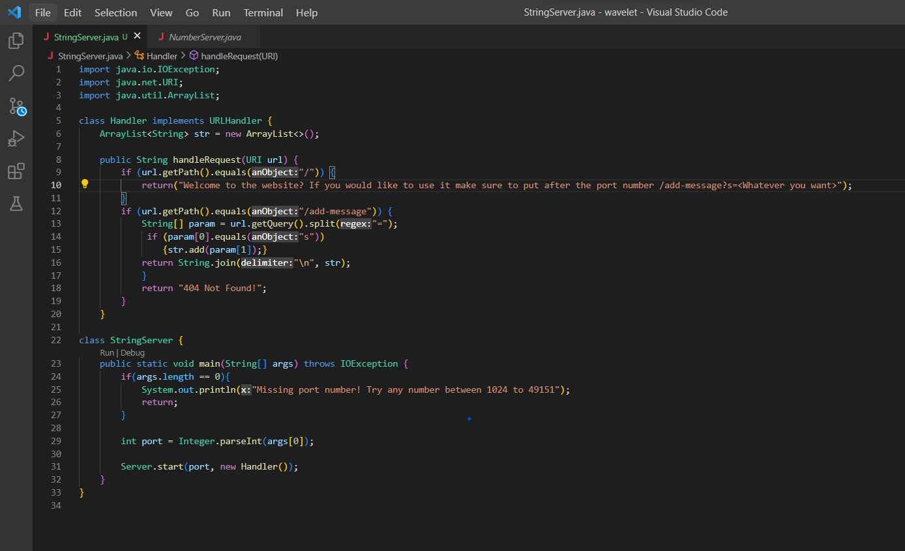
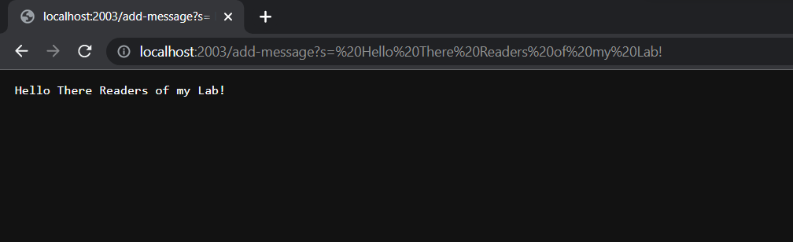
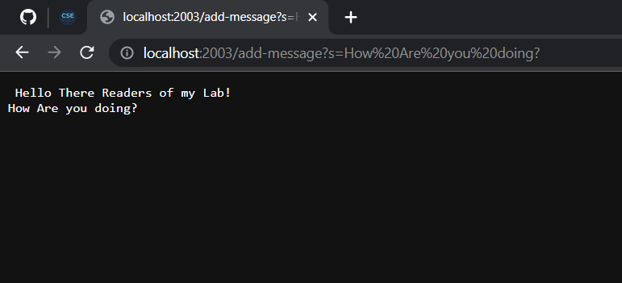
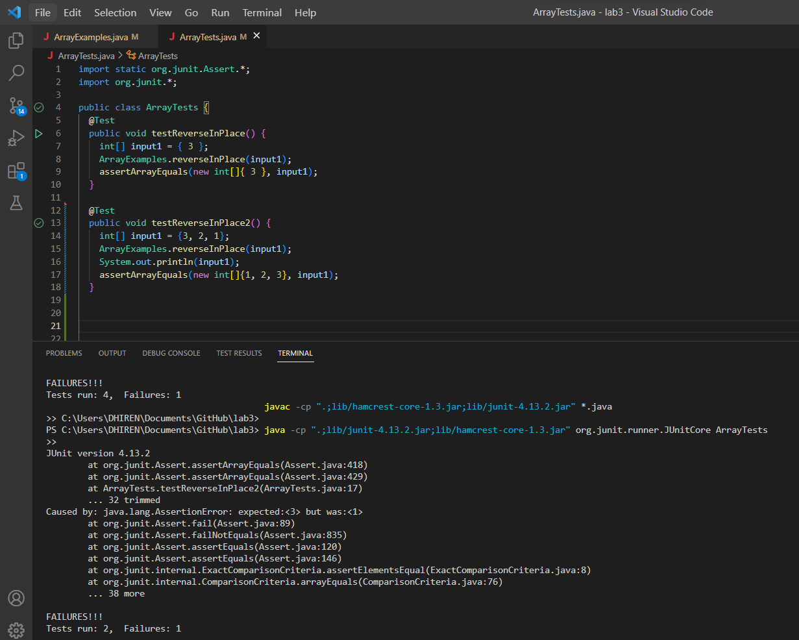

# Lab Report 2
## **Part 1**
## This is my code that I used for StringServer:


### My first implementation of /add-message:


- In the code, all methods are called in StringServer.java with both classes, as the main method in the String Server class and the handleRequest method in the Handler class are called in this instance
- The main relevant argument that is utilized is the url itself, as it would contain the query to be able to make the changes. The relevant field is the ArrayList str in this case as it gives us a space where we could add the different string phrases we want to add in the server
- The ArrayList is seemingly the only relevant field that does change, as when you keep on inputting different phrases into the url to show on the website the ArrayList becomes larger, as shown in the next instance


### My second implementation of /add-message:


- Very similar to the first implementation, but it seems to add to the ArrayList as it keeps the first phrase that we had inputted in the url while inputting the phrase I just put in right under the first in a new line.

--- 
## **Part 2**
## This is the buggy code that I had chose:
``` 
static void reverseInPlace(int[] arr) 
    for(int i = 0; i < arr.length; i += 1) {
      arr[i] = arr[arr.length - i - 1];
    }
  }
 ```
### Here is an input that does induce a failure:
```
@Test 
public void testReverseInPlace2() {
    int[] input1 = {3, 2, 1};
    ArrayExamples.reverseInPlace(input1);
    System.out.println(input1);
    assertArrayEquals(new int[]{1, 2, 3}, input1);
	}
```

## Here is an input that doesn’t induce a failure
```
@Test 
public void testReverseInPlace() {
    int[] input1 = { 3 };
    ArrayExamples.reverseInPlace(input1);
    assertArrayEquals(new int[]{ 3 }, input1);
}
```
### With the input that does not induce a failure, it passes through smoothly, but with the input that does, it brings up this error code on the terminal:



## After the bug is fixed, the code should look like this:
```
static void reverseInPlace(int[] arr) {
	for(int i = 0; i < arr.length/2; i += 1) {
		int temp = arr[i];
      		arr[i] = arr[(arr.length - i) - 1];
      		arr[(arr.length - i) - 1] = temp;
   	      }
       }
```
- What had changed between the two codes was me adding a temporary variable to keep the first half of numbers stored somewhere when reversing the order of the array. The bug here was that it was only changing one half of the array and keeping the other the same number and order. For example, an array {1,2,3} through the method with bugs would give you {3,2,3} instead. With the new code, we make sure to only go through half of the array as we are going to change the other half already when reversing the array. Then you go through however many for loops, replacing the first with the last using the temp variable, the second with the second last etc.

---

# Part 3
- The thing that i had found very interesting in either from week 2 or week 3 was creating a server. I have not had much experience with creating a server so this was a very cool and fun experience to see how everything is working together to make the web server.
